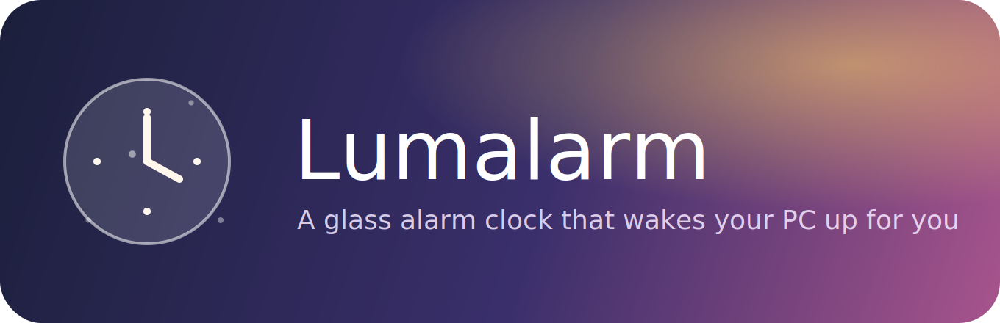
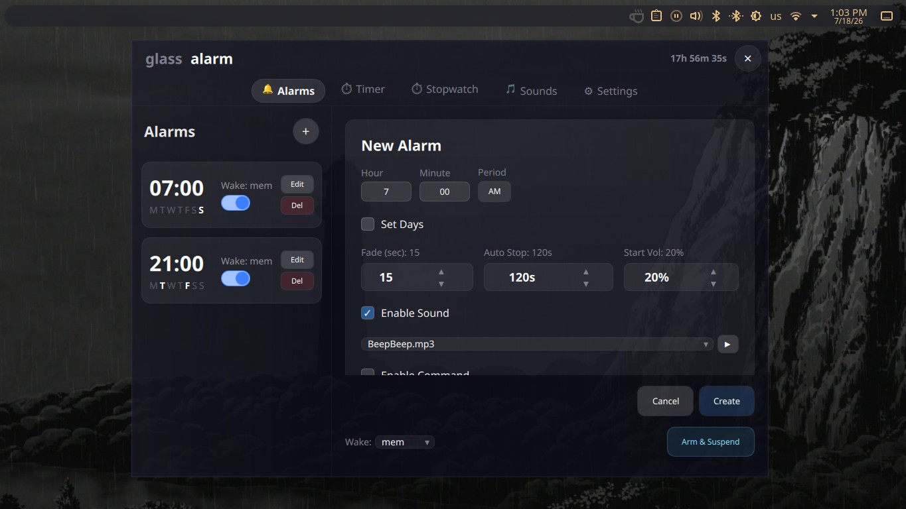
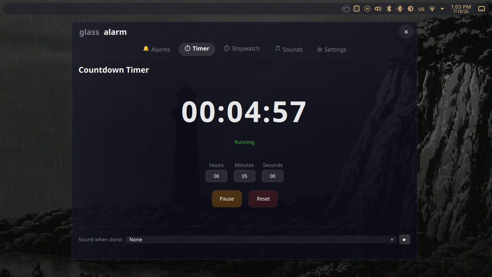
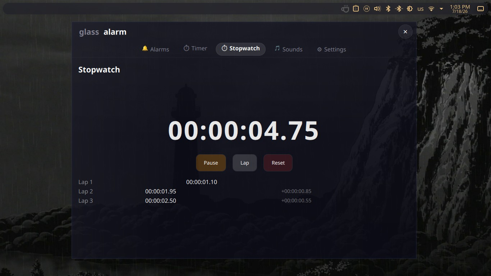
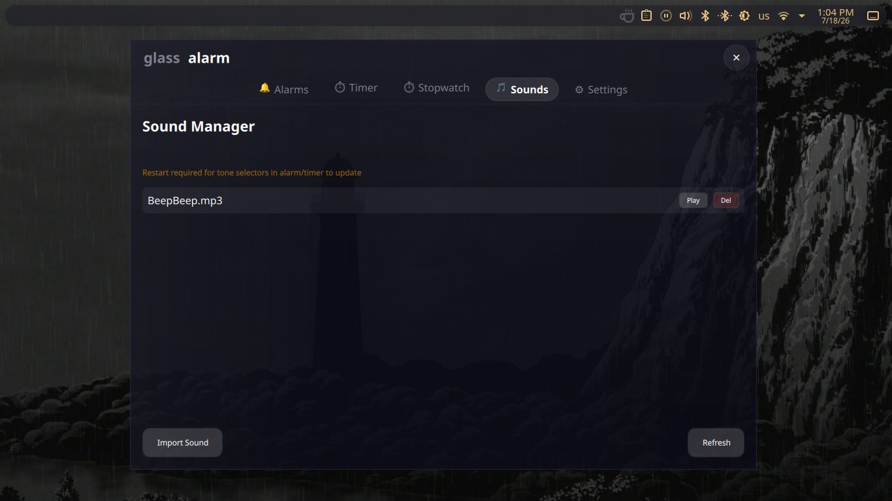

<div align="center">



**A glassmorphism alarm clock for Linux, built with Qt 6 (QML + C++)**

Suspend-to-RAM wake scheduling · typing challenges · wake-up verification · timer · stopwatch · sound manager

[](LICENSE)
[](https://www.qt.io/)
[]()

</div>

---

## Why Lumalarm?

Most alarm clocks assume your PC is already on. **Lumalarm doesn't.** Hit **Arm & Suspend** and it puts your Linux machine to sleep (via `rtcwake`), then wakes it back up automatically right before your alarm fires — no need to leave your computer running all night just to hear an alarm in the morning.

And once it wakes you, it makes sure you actually **get up**: a typing challenge or a "still awake?" check keeps you honest, instead of trusting a snooze button you'll hit in your sleep.

That's the core idea. Everything else below — timer, stopwatch, sound manager, glassmorphism theming — is a bonus on top.

---

## Table of Contents

- [Features](#features)
- [Screenshots](#screenshots)
- [Installation](#installation)
  - [Dependencies](#dependencies)
  - [Build from Source](#build-from-source)
- [Configuration](#configuration)
- [rtcwake Setup](#rtcwake-setup)
- [Contributing](#contributing)
- [License](#license)

---

## Features

- **Alarms** — recurring or one-shot, with typing challenges and a "still awake?" check to stop you from oversleeping
- **Countdown timer & stopwatch** — with laps and completion sounds
- **Sound manager** — import and preview your own tones (`wav`, `mp3`, `ogg`, `flac`, `aac`)
- **Volume fade-in & auto-stop** — wakes you up gently instead of blasting you out of bed
- **Custom commands** — run any shell command when an alarm fires
- **Fully themeable** — glassmorphism UI with a built-in HSV color picker for background, accent, and opacity

---

## Screenshots

| Alarms | Timer |
|---|---|
|  |  |

| Stopwatch | Sound Manager |
|---|---|
|  |  |

---

## Installation

### Dependencies

- **Qt 6** — Core, Multimedia, Qml, Quick, QuickControls2
- **CMake** ≥ 3.16
- **C++17** compiler (GCC or Clang)
- **rtcwake** *(optional)* — from `util-linux`, needed for suspend-to-RAM

<details>
<summary><b>Arch Linux</b></summary>

```bash
sudo pacman -S cmake qt6-base qt6-multimedia qt6-declarative qt6-quickcontrols2
```
</details>

<details>
<summary><b>Ubuntu / Debian</b></summary>

```bash
sudo apt install cmake build-essential qt6-base-dev qt6-multimedia-dev qt6-declarative-dev qt6-quickcontrols2-dev
```
</details>

<details>
<summary><b>Fedora</b></summary>

```bash
sudo dnf install cmake qt6-qtbase-devel qt6-qtmultimedia-devel qt6-qtdeclarative-devel qt6-qtquickcontrols2-devel
```
</details>

### Build from Source

```bash
git clone https://github.com/shinigami1231111/lumalarm.git
cd lumalarm
cmake -B build -DCMAKE_BUILD_TYPE=Release
cmake --build build -j$(nproc)
./build/lumalarm
```

> An AUR `PKGBUILD` is also included in the repository for Arch Linux packaging.

---

## Configuration

All data lives in `~/.config/lumalarm/`:

| Path | Purpose |
|---|---|
| `settings.ini` | Theme colors, opacity, defaults |
| `alarms.json` | Alarm list (persisted, human-readable) |
| `tones/` | Imported alarm sound files |

To add tones without the GUI:

```bash
cp my-sound.wav ~/.config/lumalarm/tones/
```

---

## rtcwake Setup

The "Arm & Suspend" button calls `sudo rtcwake`. To allow passwordless execution:

```bash
echo "$USER ALL=(ALL) NOPASSWD: /usr/bin/rtcwake" | sudo tee /etc/sudoers.d/lumalarm
sudo chmod 440 /etc/sudoers.d/lumalarm
```

Without this, you'll be prompted for a password every time the suspend button is clicked.

**Available suspend modes:**

| Mode | Behavior |
|---|---|
| `mem` | Suspend-to-RAM |
| `disk` | Hibernate |
| `none` | Just set the RTC wake time, don't suspend |

---

## Contributing

Contributions are welcome! Feel free to open an issue or submit a pull request for bug fixes, new features, or theme presets.

---

## License

Licensed under the **GNU General Public License v3.0** — see [LICENSE](LICENSE) for details.
