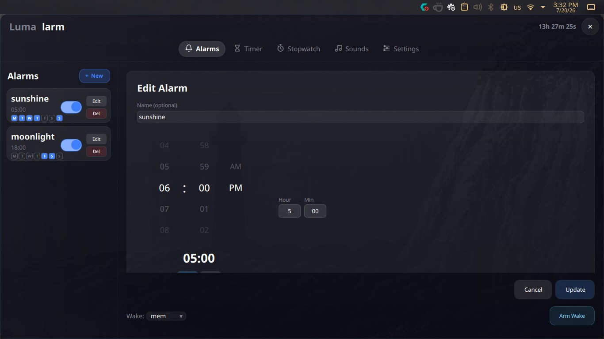
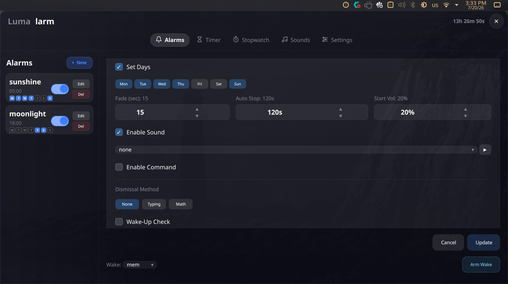
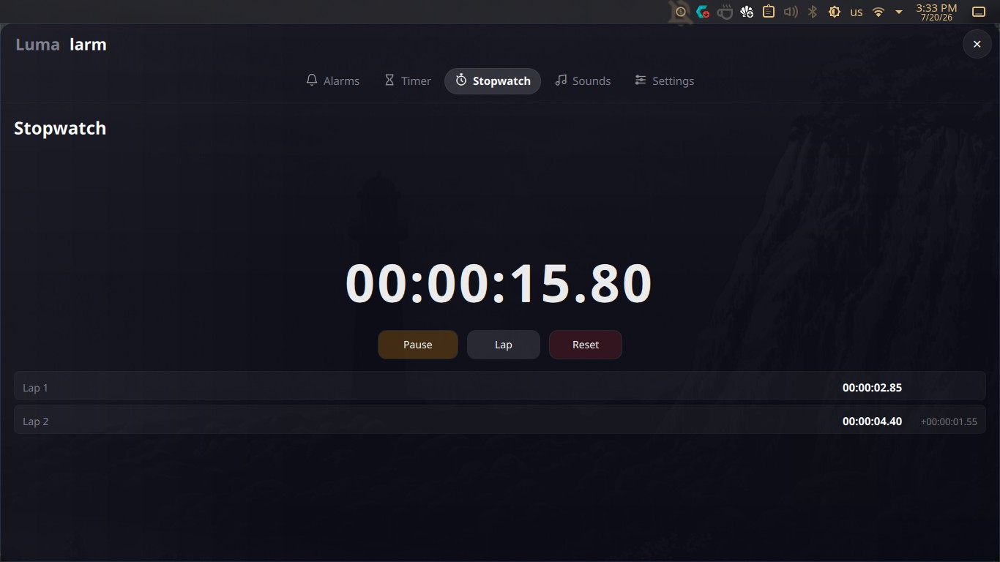
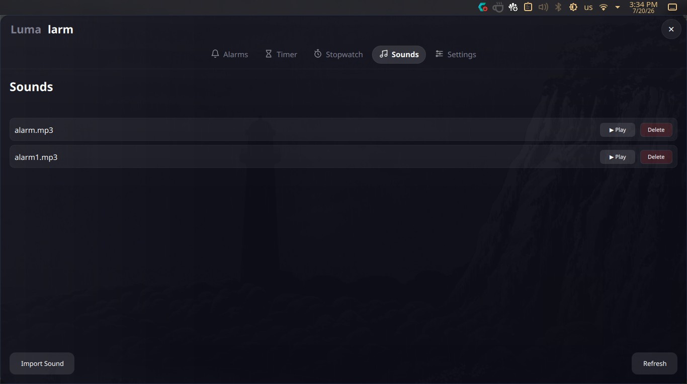
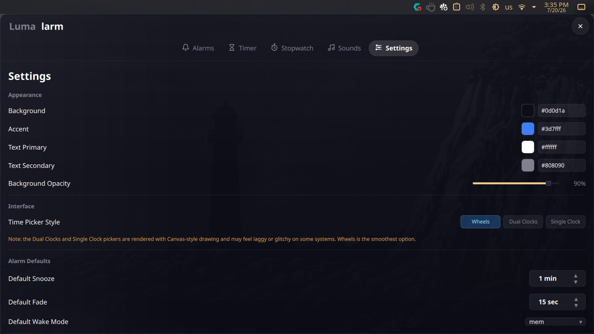

<div align="center">

**Lumalarm** — a smart alarm clock for Linux that wakes your computer from sleep

Suspend-to-RAM wake scheduling · anti-oversleep challenges · timer · stopwatch · sound manager

[](LICENSE)
[](https://www.qt.io/)
[]()

</div>

---

## The idea

**Lumalarm is an alarm clock that turns your Linux PC into a real alarm clock.**

Most alarm apps assume your computer is already awake. Lumalarm doesn't. Hit **Arm & Suspend** and it puts the machine to sleep (via `rtcwake`), then wakes it back up automatically — right before your alarm fires. No leaving the PC running all night just to hear a beep in the morning.

And once it wakes you, it makes sure you actually **get up**: a typing or math challenge, a "still awake?" check, and escalating prompts keep you honest instead of letting you hit snooze in your sleep.

That suspend-to-wake behavior is the core power of Lumalarm. Everything else — the timer, stopwatch, sound manager, and the clean themable interface — is built on top of it.

---

## Screenshots

**Alarms**




**Timer**


**Stopwatch**



**Sound Manager**



**Settings**



---

## Features

- **Alarms that wake a sleeping PC** — recurring or one-shot, scheduled to wake the machine from suspend via `rtcwake`
- **Anti-oversleep challenges** — typing challenge or math problem to dismiss an alarm
- **"Still awake?" check** — verifies you're up instead of trusting the snooze button
- **Soundscape wake** — ambient track plays quietly 90s before the alarm, ramps in, then crossfades to the main tone
- **Snooze limiting** — set a max number of snoozes per alarm (or disable snooze entirely)
- **Escalating wake** — screen brightness ramp, then sound, then forced challenge if you don't respond
- **Alarm notes** — attach a note ("flight to Istanbul") shown prominently when the alarm fires
- **Countdown timer & stopwatch** — with laps and completion sounds
- **Sound manager** — import and preview your own tones (`wav`, `mp3`, `ogg`, `flac`, `aac`)
- **Volume fade-in & auto-stop** — wakes you up gently instead of blasting you out of bed
- **Custom commands** — run any shell command when an alarm fires
- **Fully themeable** — a built-in color picker for background, accent, and opacity, plus a selectable time-picker style (wheels, dual clocks, single clock)

---

## Table of Contents

- [Installation](#installation)
  - [Dependencies](#dependencies)
  - [Build from Source](#build-from-source)
  - [AUR](#aur)
- [Configuration](#configuration)
- [rtcwake Setup](#rtcwake-setup)
- [Contributing](#contributing)
- [License](#license)

---

## Installation

### Dependencies

- **Qt 6** — Core, Multimedia, Qml, Quick, Declarative
- **CMake** ≥ 3.16
- **C++17** compiler (GCC or Clang)
- **rtcwake** *(optional)* — from `util-linux`, needed for suspend-to-RAM

<details>
<summary><b>Arch Linux</b></summary>

```bash
sudo pacman -S cmake qt6-base qt6-multimedia qt6-declarative
```
</details>

<details>
<summary><b>Ubuntu / Debian</b></summary>

```bash
sudo apt install cmake build-essential qt6-base-dev qt6-multimedia-dev qt6-declarative-dev
```
</details>

<details>
<summary><b>Fedora</b></summary>

```bash
sudo dnf install cmake qt6-qtbase-devel qt6-qtmultimedia-devel qt6-qtdeclarative-devel
```
</details>

### Build from Source

```bash
git clone https://github.com/shinigami1231111/lumalarm.git
cd lumalarm
cmake -B build -DCMAKE_BUILD_TYPE=Release
cmake --build build -j$(nproc)
./build/lumalarm
```

### AUR

```bash
paru -S lumalarm
# or, with yay:
yay -S lumalarm
```

---

## Configuration

All data lives in `~/.config/lumalarm/`:

| Path | Purpose |
|---|---|
| `settings.ini` | Theme colors, opacity, defaults |
| `alarms.json` | Alarm list (persisted, human-readable) |
| `tones/` | Imported alarm sound files |

To add tones without the GUI:

```bash
cp my-sound.wav ~/.config/lumalarm/tones/
```

---

## rtcwake Setup

The "Arm & Suspend" button calls `sudo rtcwake`. To allow passwordless execution:

```bash
echo "$USER ALL=(ALL) NOPASSWD: /usr/bin/rtcwake" | sudo tee /etc/sudoers.d/lumalarm
sudo chmod 440 /etc/sudoers.d/lumalarm
```

Without this, you'll be prompted for a password every time the suspend button is clicked.

**Available suspend modes:**

| Mode | Behavior |
|---|---|
| `mem` | Suspend-to-RAM |
| `disk` | Hibernate |
| `none` | Just set the RTC wake time, don't suspend |

---

## Contributing

Contributions are welcome! Feel free to open an issue or submit a pull request for bug fixes, new features, or theme presets.

---

## License

Licensed under the **GNU General Public License v3.0** — see [LICENSE](LICENSE) for details.
